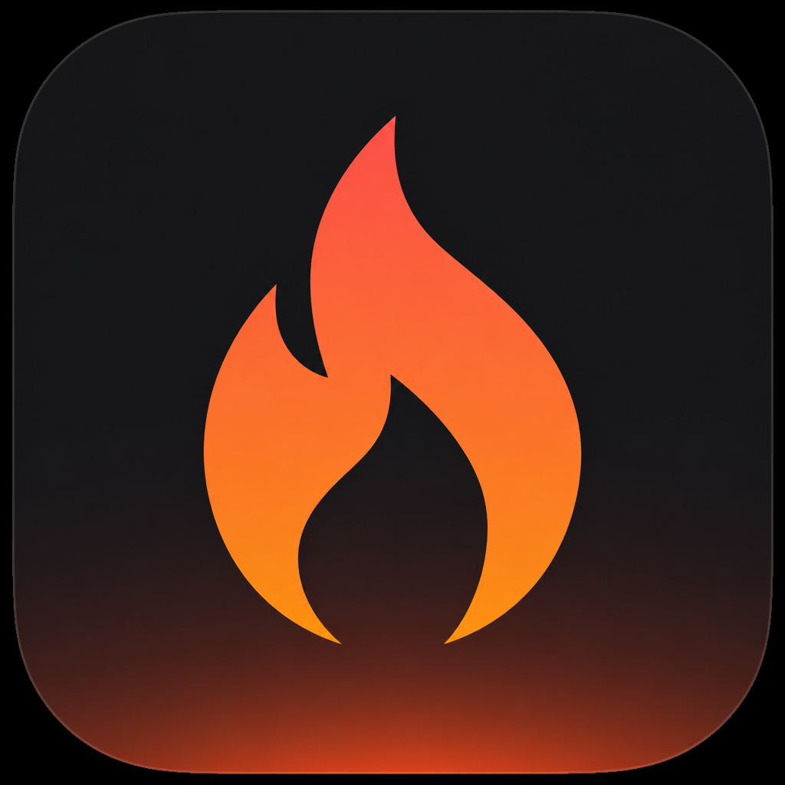

<div align="center">



# Burnrate

**See how fast you're burning Cursor spend — without opening the dashboard.**

A lightweight macOS menu bar app that shows your Cursor usage in real time,
breaks it down by model, session, skill, and prompt, and notifies you when
spend spikes.

[](https://github.com/tomyweiss/Burnrate/releases)


[](LICENSE)

</div>

---

## Why Burnrate?

Cursor's usage dashboard lives in the browser and always feels one tab too far
away. Burnrate sits in your menu bar with a flame and a dollar amount — click
it and you get the full picture: what you spent, on which models, in which
chats, and whether you're in the middle of a spike.

- **At-a-glance total** — spend for your selected window, right in the menu bar
- **Spike alerts** — a macOS notification when spend crosses your threshold (default $10 / 10 min)
- **Zero setup** — uses your signed-in Cursor IDE session; nothing to paste, nothing stored
- **Privacy-minded** — no analytics, no third-party servers, and no model calls (it won't bump your AI usage)

## Install

```bash
git clone https://github.com/tomyweiss/Burnrate.git
cd Burnrate
bash scripts/package.sh --install --open
```

This builds a release binary, installs `Burnrate.app` to `/Applications`, and launches it.

> [!NOTE]
> **First launch:** the app isn't Apple-notarized. If Gatekeeper blocks it,
> right-click the app → **Open**, or run:
>
> ```bash
> xattr -dr com.apple.quarantine /Applications/Burnrate.app
> open /Applications/Burnrate.app
> ```

Verify it can reach your usage data:

```bash
/Applications/Burnrate.app/Contents/MacOS/Tokens --status
# OK $12.40 today (67 events)
```

### Requirements

- macOS 26 or later
- [Cursor](https://cursor.com) installed and signed in on the same Mac
- Xcode 26 (or Command Line Tools with the macOS 26 SDK) to build from source

## Tour

### Menu bar

| You see | It means |
|---------|----------|
| Flame + `$12.40` | Spend for your selected window; click for the panel |
| Filled flame | Recent-window spend ≥ your spike threshold |
| Warning triangle | Auth or API problem (last known amount still shown when possible) |

### The panel

The header shows the window total, a **burn pill** with spend in your rolling
alert window (e.g. last 10 minutes), and an hourly/daily **sparkline** for the
shape of spend across the active window. A timeline picker switches between
**Today**, **Last 24h**, **Last 7d**, and **This billing** (configurable
billing day and timezone).

Below that, five tabs slice the same window:

| Tab | What it shows |
|-----|---------------|
| **Models** | Cost share per model; expand for token detail and per-session rows |
| **Sessions** | Chats across models, with titles and workspace names from local Cursor data; drill into a session for its prompts and subagents |
| **Skills** | Cost per slash command, with total / average / median views |
| **Feed** | Every prompt with its attributed cost, tokens, duration, and models |
| **Bench** | Scatter chart comparing models, skills, or sessions on cost, speed, and volume — top-right is best |

### Settings

Timeline window, billing day, timezone, poll interval, spike threshold /
window / cooldown, launch at login, hide the menu bar amount, blur sensitive
content (for demos and screen shares), test notification, and updates.

## How it works

1. Loads your local Cursor session from
   `~/Library/Application Support/Cursor/User/globalStorage/state.vscdb`
2. Polls `POST https://cursor.com/api/dashboard/get-filtered-usage-events` for events in the selected window
3. Sums Cursor's `chargedCents` for totals, sparkline buckets, models, sessions, skills, and prompts
4. Resolves chat titles and workspaces from local composer metadata when available

Costs are Cursor-reported charges from usage events, not a hand-rolled price
estimate. Full behavior: [CAPABILITIES.md](CAPABILITIES.md).

### Privacy & security

- Reads `cursorAuth/accessToken` from Cursor's local SQLite DB on each refresh — **never written** to Burnrate's own storage or Keychain
- Fetches usage over HTTPS from Cursor's dashboard endpoints using that session
- Session names and workspace folders come from **local** Cursor composer metadata (and cloud agent cache for `bc-*` sessions)
- No analytics, no third-party servers, no model/API calls that consume Cursor usage
- Self-updates require a minisign signature matching the embedded public key (not only a SHA-256 checksum from the same release)

## Self-updates

Burnrate can update itself from [GitHub Releases](https://github.com/tomyweiss/Burnrate/releases)
without an Apple Developer ID:

1. Checks `releases/latest` for a newer version tag
2. Downloads `Burnrate-x.y.z.zip`, verifies `Burnrate-x.y.z.sha256`, then verifies the minisign signature (`Burnrate-x.y.z.zip.minisig`) against the embedded public key
3. Quits, replaces the running `.app`, strips quarantine, relaunches

Use **⋯ → Check for Updates…** or Settings → Updates. You confirm before
install. Builds are **not notarized**; if macOS blocks a new build,
right-click → Open or run `xattr -dr com.apple.quarantine` on the app.

## Limitations

- Relies on Cursor's **undocumented** dashboard API — it can change or break without notice
- Individual / personal session only (the account signed into Cursor on this Mac)
- Longer windows (7d, billing cycle) may hit the API pagination cap (~4000 events) for heavy users
- Not an official Cursor product; totals may differ slightly from the website
- Not notarized for distribution outside building from source

## Development

```bash
swift build
bash scripts/package.sh --open
```

Side-by-side contributor build (does not overwrite `/Applications/Burnrate.app`):

```bash
bash scripts/package.sh --dev --install --open
# or: make install-dev
```

This installs `Burnrate-dev.app` with bundle id `com.tomyweiss.burnrate.dev`.
The menu bar keeps the normal `$` amount and adds a small gray dot next to the
flame; the panel shows an orange **DEV** badge. Self-updates are disabled.
Version defaults to the latest git tag (override with `VERSION=…`).

**Hot reload:** rebuilds and relaunches `Burnrate-dev` whenever Swift sources
change (debug build for speed). Ctrl-C stops the watcher.

```bash
make watch-dev
# or: bash scripts/dev-watch.sh
```

One-shot debug install: `bash scripts/package.sh --dev --debug --install --open`.

Package layout: Swift package target `Tokens` (internal name), shipped as **Burnrate.app**.

<details>
<summary><strong>Cutting a release (maintainers)</strong></summary>

Requires [minisign](https://jedisct1.github.io/minisign/) and the release
signing secret key at `~/.config/burnrate/burnrate.key` (or set
`MINISIGN_SECRET_KEY`). The matching public key is committed as
[`burnrate.pub`](burnrate.pub) and embedded in the app.

```bash
bash scripts/release.sh
```

This checks out latest `main`, patch-bumps from the newest `v*` tag, creates
and pushes the tag, then builds, signs, and uploads:

- `Burnrate-x.y.z.zip`
- `Burnrate-x.y.z.sha256`
- `Burnrate-x.y.z.zip.minisig`

Before releasing, commit your changes on `main`. Release notes are
**auto-generated** from git commits since the previous `v*` tag and published
to GitHub (shown in the in-app update banner).

Use `--dry-run` to preview the next version without tagging or uploading. Use
`--yes` to skip the confirmation prompt.

**Manual override** (hotfix or re-release to an existing version):

```bash
VERSION=0.0.7 bash scripts/package.sh --release
```

`VERSION=v0.0.7` works the same (leading `v` is stripped). Requires `gh` auth
and the minisign secret key. The zip must contain `Burnrate.app` at the top
level. Updates without a valid `.minisig` are rejected.

</details>

## Contributing

Issues and PRs are welcome. Please keep changes focused; this is intentionally
a small menu bar utility.

## License

[MIT](LICENSE) © Tom Weiss
