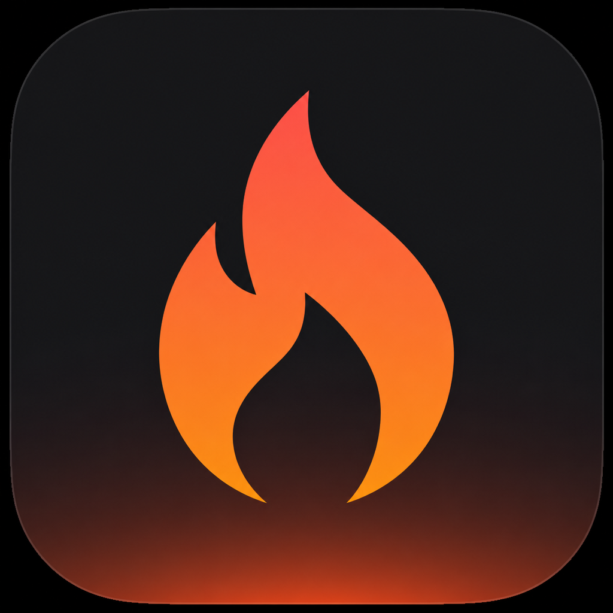

<div align="center">



# Burnrate

**See how fast you're burning Cursor spend — without opening the dashboard.**

A lightweight macOS menu bar app that shows your Cursor usage in real time,
breaks it down by model, session, skill, and prompt, and notifies you when
spend spikes.

[](https://github.com/tomyweiss/Burnrate/releases)


[](LICENSE)

</div>

---

## Why Burnrate?

Cursor's usage dashboard lives in the browser and always feels one tab too far
away. Burnrate sits in your menu bar with a flame and a dollar amount — click
it and you get the full picture: what you spent, on which models, in which
chats, and whether you're in the middle of a spike.

- **At-a-glance total** — spend for your selected window, right in the menu bar
- **Spike alerts** — a macOS notification when spend crosses your threshold (default $10 / 10 min)
- **Zero setup** — uses your signed-in Cursor IDE session; nothing to paste, nothing stored
- **Privacy-minded** — no analytics by default, no model calls (it won't bump your AI usage); optional Community tab shares anonymous 24h aggregates only if you opt in

## Install

Download the latest `Burnrate-*.zip` from
[Releases](https://github.com/tomyweiss/Burnrate/releases), unzip, and move
`Burnrate.app` to `/Applications`.

Or build from source (requires local maintainer `scripts/` — not shipped in the
public repo):

```bash
git clone https://github.com/tomyweiss/Burnrate.git
cd Burnrate
bash scripts/package.sh --install --open
```

This builds a release binary, installs `Burnrate.app` to `/Applications`, and launches it.

> [!NOTE]
> **First launch:** the app isn't Apple-notarized. If Gatekeeper blocks it,
> right-click the app → **Open**, or run:
>
> ```bash
> xattr -dr com.apple.quarantine /Applications/Burnrate.app
> open /Applications/Burnrate.app
> ```

Verify it can reach your usage data:

```bash
/Applications/Burnrate.app/Contents/MacOS/Tokens --status
# OK $12.40 today (67 events)
```

### Requirements

- macOS 26 or later
- [Cursor](https://cursor.com) installed and signed in on the same Mac
- Xcode 26 (or Command Line Tools with the macOS 26 SDK) to build from source

## Tour

### Menu bar

| You see | It means |
|---------|----------|
| Flame + `$12.40` | Spend for your selected window; click for the panel |
| Filled flame | Recent-window spend ≥ your spike threshold |
| Warning triangle | Auth or API problem (last known amount still shown when possible) |

### The panel

The header shows the window total, a **burn pill** with spend in your rolling
alert window (e.g. last 10 minutes), and an hourly/daily **sparkline** for the
shape of spend across the active window. A timeline picker switches between
**Today**, **Last 24h**, **Last 7d**, and **This billing** (configurable
billing day and timezone).

Below that, six tabs slice the same window:

| Tab | What it shows |
|-----|---------------|
| **Models** | Cost share per model; expand for token detail and per-session rows |
| **Sessions** | Chats across models, with titles and workspace names from local Cursor data; drill into a session for its prompts, subagents, and local conversation log path when available |
| **Skills** | Cost per slash command, with total / average / median views |
| **Community** | Opt-in anonymous 24h spend rank vs other sharers (share-to-view) |
| **Feed** | Every prompt with its attributed cost, tokens, duration, and models |
| **Bench** | Scatter chart comparing models, skills, or sessions on cost, speed, and volume — top-right is best |

### Settings

Timeline window, billing day, timezone, poll interval, spike threshold /
window / cooldown, launch at login, hide the menu bar amount, blur sensitive
content (for demos and screen shares), test notification, and updates.

## How it works

1. Loads your local Cursor session from the desktop app (`state.vscdb`) or Agent CLI login (`~/.cursor/auth.json` / Keychain `cursor-access-token`)
2. Polls `POST https://cursor.com/api/dashboard/get-filtered-usage-events` for events in the selected window
3. Sums Cursor's `chargedCents` for totals, sparkline buckets, models, sessions, skills, and prompts
4. Resolves chat titles and workspaces from local composer metadata when available

Costs are Cursor-reported charges from usage events, not a hand-rolled price
estimate. Full behavior: [CAPABILITIES.md](CAPABILITIES.md).

### Privacy & security

- Reads `cursorAuth/accessToken` from Cursor's local SQLite DB, or the Agent CLI login token, on each refresh — **never written** to Burnrate's own storage or Keychain
- Fetches usage over HTTPS from Cursor's dashboard endpoints using that session
- Session names and workspace folders come from **local** Cursor composer metadata (and cloud agent cache for `bc-*` sessions)
- No analytics; no model/API calls that consume Cursor usage
- **Community (opt-in):** uploads anonymous rolling 24h spend + per-model costs to the Burnrate community API when you enable sharing; never session titles, prompts, or Cursor identity. Turning sharing off deletes your server row. You only see cohort data if you share.
- Self-updates use Sparkle (EdDSA). Auto-check is daily. Burnrate-dev does not auto-update from GitHub

## Self-updates

Production **Burnrate.app** uses [Sparkle 2](https://sparkle-project.org):

1. Checks the Sparkle appcast (`appcast.xml` on `main`) once a day
2. You confirm; Sparkle verifies the EdDSA signature and replaces the running app
3. The app relaunches

Use **Settings → Check for Updates…**. Builds are **not notarized**; if macOS
blocks a new build, right-click → Open or run `xattr -dr com.apple.quarantine`
on the app.

Burnrate-dev never auto-updates from GitHub (that would overwrite a local
contributor build with `Burnrate.app`).

**Do not commit a Sparkle private key.** Tom generates the pair with
`generate_keys` on his Mac. Clients that never installed the Sparkle bridge
release cannot jump to this tag.

Old minisign-only clients cannot update to this version — they need the
bridge GitHub Release first. [`burnrate.pub`](burnrate.pub) is kept so old
zips can still be verified by hand. Keep `burnrate.key` locally until this
tag is out; then archive it if you want.

## Limitations

- Relies on Cursor's **undocumented** dashboard API — it can change or break without notice
- Individual / personal session only (the account signed into Cursor on this Mac)
- Longer windows (7d, billing cycle) may hit the API pagination cap (~4000 events) for heavy users
- Not an official Cursor product; totals may differ slightly from the website
- Not notarized for distribution outside building from source

## Development

```bash
swift build
bash scripts/package.sh --open
```

Side-by-side contributor build (does not overwrite `/Applications/Burnrate.app`):

```bash
bash scripts/package.sh --dev --install --open
# or: make install-dev
```

This installs `Burnrate-dev.app` with bundle id `com.tomyweiss.burnrate.dev`.
The menu bar keeps the normal `$` amount and adds a small gray dot next to the
flame; the panel shows an orange **DEV** badge. Self-updates are disabled.
Version defaults to the latest git tag (override with `VERSION=…`).

**Hot reload:** rebuilds and relaunches `Burnrate-dev` whenever Swift sources
change (debug build for speed). Ctrl-C stops the watcher.

```bash
make watch-dev
# or: bash scripts/dev-watch.sh
```

One-shot debug install: `bash scripts/package.sh --dev --debug --install --open`.

Package layout: Swift package target `Tokens` (internal name), shipped as **Burnrate.app**.

<details>
<summary><strong>Cutting a release (maintainers)</strong></summary>

Maintainer packaging/release helpers live in a local `scripts/` directory (not
in the public repo). Keep your own copy beside the checkout.

Requires Tom's Sparkle EdDSA private key in Keychain (`generate_keys`).
`scripts/package.sh --release` should run Sparkle `sign_update` /
`generate_appcast` (see [`Release/prepare-sparkle-appcast.sh`](Release/prepare-sparkle-appcast.sh)),
not `minisign -Sm`. Do not attach `.minisig` as required for new tags.

Merge the public key into [`Resources/Sparkle.plist`](Resources/Sparkle.plist)
and inject those keys from local `scripts/package.sh`. Embed
`Sparkle.framework` with [`Release/embed-sparkle-framework.sh`](Release/embed-sparkle-framework.sh).

### One PR per release (changelog in the feature PR)

1. **Before opening your feature PR**, check the next version:

   ```bash
   bash scripts/release.sh --next-version
   # or: bash scripts/release.sh --dry-run
   ```

2. **Add a changelog section** at the top of
   `Sources/Tokens/Resources/CHANGELOG.md` in the same PR:

   ```markdown
   ## 0.0.41

   - Your user-facing change description (optional commit hash)
   ```

3. **Merge the feature PR** to `main`.

4. **Tag and publish** (no separate changelog PR):

   ```bash
   bash scripts/release.sh --yes
   ```

This tags `main`, builds, Sparkle-signs, and uploads:

- `Burnrate-x.y.z.zip`

Then commit the updated `appcast.xml`. Do not require `.minisig` on new tags.

Release notes on GitHub and in the in-app change log come from the merged
**CHANGELOG.md** section for that version.

`--dry-run` previews the next version and whether the changelog is already on
`main`. Without `--yes`, the script can still draft a changelog and open a
fallback PR if the section was not merged in the feature PR.

**Manual override** (hotfix or re-release to an existing version):

```bash
VERSION=0.0.7 bash scripts/package.sh --release
```

`VERSION=v0.0.7` works the same (leading `v` is stripped). Requires `gh` auth
and Tom's Sparkle private key in Keychain. The zip must contain `Burnrate.app`
at the top level.

</details>

## Contributing

Issues and PRs are welcome. Please keep changes focused; this is intentionally
a small menu bar utility.

## License

[MIT](LICENSE) © Tom Weiss
